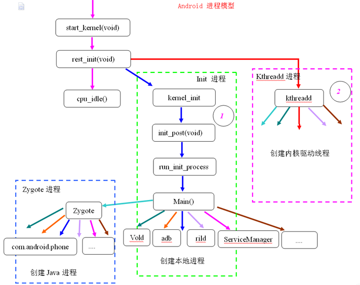

应用程序进程具有两个特点:  
一是进程的入口函数是 ActivityThread.main,   
二是进程天然支持 Binder 进程间通信机制;  

### init 进程  
当按下电源键   
cpu 上电, 芯片上的预设代码开始执行, 加载引导程序 Bootloader 到 ram 中运行;  
Bootloader 负责初始化硬件资源和加载 linux kernel, 然后将控制权交给 linux kernel;    
linux kernel 得到控制权后, 调用下列一系列函数:  
初始化内存分配;  
初始化文件系统;  
加载硬件驱动;  
初始化和启动属性服务;  
fork init 进程, init 进程会启动 ServiceManager 和 android 的 Zygote 进程;  
启动 ServiceManager 为 BinderDevice 注册上下文管理者;   
  

### Zygote 进程  
Android 是基于 Linux 系统的, 当手机开机的时候, Linux 的内核加载完成之后, 就会启动一个 "init" 的进程;   
在 Linux 系统中, 所有的进程都是由 init 进程 fork 出来的, zygote 进程也不例外;  
在 Android 系统中, 所有的应用程序进程以及系统服务进程 SystemServer, 都是由 Zygote 进程 fork 出来的, 都是 zygote 的子进程;  

Zygote 进程共做了如下几件事:   
解析 init.zygote.rc 中的参数, 创建 AppRuntime 并调用 AppRuntime.start()方法;  
调用 AndroidRuntime 的 startVM()方法创建虚拟机, 再调用 startReg()注册 JNI 函数;     
通过 JNI 方式调用 ZygoteInit.main(), 第一次进入 Java 世界;  
registerZygoteSocket()建立 socket 通道, 作为 IPC 通信服务端, zygote 作为通信的服务端, 用于响应客户端请求;   
通过 registerZygoteSocket 函数创建服务端 Socket, 并通过 runSelectLoop 函数等待 ActivityManagerService 的请求来创建新的应用程序进程;  
启动 SystemServer 进程;  
执行 preloadClasses  和 preloadResource 函数, 分别是加载 class 文件到内存, 和加载资源文件到内存, 这个过程是很耗时间的, 所以开机会比较慢;   
preload()预加载通用类, drawable 和 color 资源, openGL 以及共享库以及 WebView, 用于提高 app 启动效率;  

### SystemServer 进程  
在  ZygoteInit.main()方法里 调用 forkSystemServer 方法 fork 了 SystemServer;  
系统里面重要的服务都是在这个进程里面开启的, 比如:   
ActivityManagerService, PackageManagerService, WindowManagerService, DisplayManagerService 等等;  
最后调用Looper.loop(); 进行消息循环, 后续会处理相关消息;  

SystemServer在启动时做了如下工作:   
启动 Binder 线程池, 这样就可以与其他进程进行通信;   
创建 SystemServiceManager 用于对系统的服务进行创建, 启动和生命周期管理;  
启动各种系统服务;  

### ActivityManagerService  
SystemServer 进程 #run 方法 ⤑ #startBootstrapServices 方法 ⤑  启动 ActivityManagerService;  
在 SystemService.java 的run方法, ActivityManagerService 向 Native 的 ServiceManager 注册服务;  
ActivityManagerService 是服务端对象, 负责系统中所有 Activity 的生命周期;  
创建 ActivityManager, ProcessRecord, ServiceManager;  
start 方法中, 反射调用 ActivityThread.main方法;  

createSystemContext  
初始化系统上下文对象 mSystemContext, 并设置默认的主题,mSystemContext 实际上是一个 ContextImpl 对象;    
调用 ActivityThread.systemMain()的时候, 会调用 ActivityThread.attach(true), 而在attach()里面,  
则创建了 Application 对象, 并调用了 Application.onCreate();  

内部关系  
AMP 是 AMN 的内部类, 它们都实现了 IActivityManager 接口, 这样它们就可以实现代理模式, 具体来讲是远程代理, AMP 和 AMN 是运行在两个进程的;  
AMP 是 Client 端, AMN 则是 Server 端, 而 Server 端中具体的功能都是由 AMN 的子类 AMS 来实现的, 因此AMP就是AMS在Client端的代理类;   
AMN 又实现了Binder类, 这样AMP可以和AMS就可以通过Binder来进行进程间通信;  

ActivityManager 通过 AMN 的 getDefault 方法得到 AMP, 通过 AMP 就可以和 AMN 进行通信, 也就是间接的与 AMS 进行通信;  
除了 ActivityManager, 其他想要与 AMS 进行通信的类都需要通过AMP;  

### 进程流程  
App 与 ActivityManagerService 通过 Binder 进行 IPC 通信, ActivityManagerService (SystemServer进程) 与 Zygote 通过 Socket 进行 IPC 通信;  
内核启动,  fork Zygote 进程, Zygote 进程 fork SystemServer 进程,  SystemServer fork ActivityManagerService 进程;  
init进程	Init.main()  
zygote进程	ZygoteInit.main()  
app_process进程	RuntimeInit.main()  
system_server进程	SystemServer.main()  
app进程	ActivityThread.main()  

### 点击Launcher中, App的图标后, 发生了什么  
[LauncherActivity](launcher/launcher_activity.md)  
点击桌面 App 图标, Launcher 进程采用 Binder IPC向 system_server 进程发起 startActivity 请求;  
system_server 进程接收到请求后, 向 zygote 进程发送创建进程的请求;  
Zygote 进程 fork 出新的子进程, 即 App 进程;  
App 进程, 通过 Binder IPC 向 system_server 进程发起 attachApplication 请求;  
system_server 进程在收到请求后, 进行一系列准备工作后, 再通过 binder IPC 向 App 进程发送 scheduleLaunchActivity 请求;  
App 进程的 binder 线程 (ApplicationThread) 在收到请求后, 通过 handler 向主线程发送 LAUNCH_ACTIVITY 消息;  
主线程在收到 Message 后, 通过发射机制创建目标 Activity, 并回调 Activity.onCreate()等方法;  
到此, App 便正式启动, 开始进入 Activity 生命周期, 执行完 onCreate/onStart/onResume方法, UI 渲染结束后便可以看到 App 的主界面;  

### 参考  
https://juejin.im/post/5c3832e66fb9a049e308510b  
https://github.com/LRH1993/android_interview/blob/master/android/advance/app-launch.md  
https://github.com/yipianfengye/androidSource/blob/master/14%20activity%E5%90%AF%E5%8A%A8%E6%B5%81%E7%A8%8B.md  
http://gityuan.com/2016/03/12/start-activity    
https://juejin.im/post/5c4471e56fb9a04a027aa8ac  

ActivityManagerService 参考  
http://blog.csdn.net/itachi85/article/details/76405596  
http://blog.csdn.net/itachi85/article/details/77542286

SystemServer 进程  参考  
http://blog.csdn.net/qq_23547831/article/details/51105171    
http://blog.csdn.net/itachi85/article/details/55053356  
http://liuwangshu.cn/framework/booting/3-syetemserver.html  

init进程 参考  
http://blog.csdn.net/mr_zhaojy/article/details/52776254    
http://blog.csdn.net/itachi85/article/details/54783506     
http://blog.csdn.net/hu3167343/article/details/38230271  
http://www.cnblogs.com/nokiaguy/archive/2013/04/14/3020774.html  
http://blog.jobbole.com/67931/  
http://blog.csdn.net/fu_kevin0606/article/details/53383031  
http://blog.csdn.net/sunao2002002/article/details/52454878  
http://blog.csdn.net/gaugamela/article/details/52133186  

Zygote 进程 参考   
http://blog.csdn.net/qq_23547831/article/details/51104873  
http://blog.csdn.net/luoshengyang/article/details/6768304    
http://blog.csdn.net/itachi85/article/details/55047104  
http://liuwangshu.cn/framework/booting/2-zygote.html  
http://www.cnblogs.com/samchen2009/p/3294713.html  
https://blog.csdn.net/itachi85/article/details/55047104  
http://huaqianlee.github.io/2015/08/23/Android/%E9%AB%98%E9%80%9AAndroid%E8%AE%BE%E5%A4%87%E5%90%AF%E5%8A%A8%E6%B5%81%E7%A8%8B%E5%88%86%E6%9E%90-%E4%BB%8Epower-on%E4%B8%8A%E7%94%B5%E5%88%B0Home-Lanucher%E5%90%AF%E5%8A%A8/  

Activity启动过程全解析  
http://blog.csdn.net/zhaokaiqiang1992/article/details/49428287  

Android应用程序进程启动过程的源代码分析  
http://blog.csdn.net/luoshengyang/article/details/6747696  

Android应用程序启动过程源代码分析  
http://blog.csdn.net/luoshengyang/article/details/6689748  

Android应用程序在新的进程中启动新的Activity的方法和过程分析  
http://blog.csdn.net/luoshengyang/article/details/6720261  

Android应用程序的Activity启动过程简要介绍和学习计划  
http://blog.csdn.net/luoshengyang/article/details/6685853  

Android进程间通信（IPC）机制Binder简要介绍和学习计划  
http://blog.csdn.net/luoshengyang/article/details/6618363  

Android系统启动流程（四）Launcher启动过程与系统启动流程  
http://blog.csdn.net/itachi85/article/details/56669808  
http://blog.csdn.net/itachi85/article/details/64123035  
http://blog.csdn.net/itachi85/article/details/64243223  
http://blog.csdn.net/itachi85/article/details/69388942  
http://blog.csdn.net/itachi85/article/details/72825768  
http://blog.csdn.net/itachi85/article/details/73065603  

Android深入四大组件（六）Android8.0 根Activity启动过程（前篇）    
http://blog.csdn.net/itachi85/article/details/78569299  

Android系统启动流程（四）Launcher启动过程与系统启动流程  
http://blog.csdn.net/itachi85/article/details/56669808  

http://www.jianshu.com/p/19e95bc40e37  
http://www.jianshu.com/p/f6234a975048  
http://blog.csdn.net/qq_23547831/article/details/51224992  

理解Android进程创建流程  
http://gityuan.com/2016/03/26/app-process-create/  

http://www.cnblogs.com/nokiaguy/archive/2013/04/14/3020774.html  
http://www.cnblogs.com/nokiaguy/p/3164799.html  
http://liuwangshu.cn/framework/booting/1-init.html  
https://blog.csdn.net/fu_kevin0606/article/details/53383031  
https://blog.csdn.net/sunao2002002/article/details/52454878  
https://blog.csdn.net/gaugamela/article/details/52133186  
https://blog.csdn.net/hu3167343/article/details/38230271  
http://liuwangshu.cn/framework/applicationprocess/1.html  
http://liuwangshu.cn/framework/applicationprocess/2.html  
http://liuwangshu.cn/framework/component/1-activity-start-1.html  
http://liuwangshu.cn/framework/component/1-activity-start-2.html  

