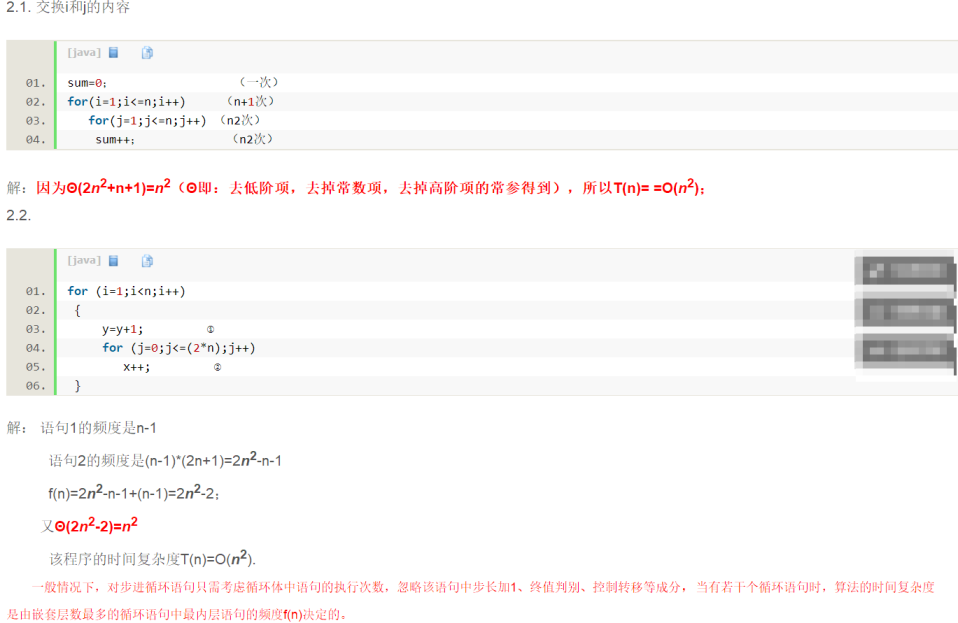

#### O(n^2)  

```
for (i=1; i<=n; i++)  
       x++;  
for (i=1; i<=n; i++)  
    　for (j=1; j<=n; j++)  
          x++;  
```

因为 第一个的复杂度是 O(n)， 第二个的复杂度是 O(n^2)；  
整体的复杂度就是 为Ο(n+n^2)  =  O(n^2)；  
 
● 推导步骤  
 
  
