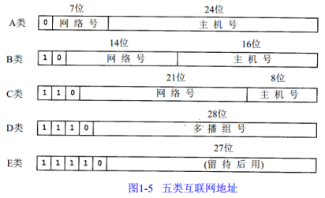

### TCP-IP协议  
[HTTP 与 HTTPS](library/Https.md)  
[URI 与 URL  ](library/URI.md)  
[MIME](library/MIME.md)  
首先TCP-IP不是一个协议, 而是一个协议族的统称, 是互联网最基本的协议族;  
TCP-IP协议族, 主要分4层, 数据链路层 → 网络层 → 传输层 → 应用层;  

★ 应用层  Application Layer  
应用层, 负责处理特定的应用程序细节;  
几乎各种不同的 TCP / IP实现, 都会提供下面这些通用的应用程序:  
HTTP 超文本传输协议;    DNS  域名解析系统;   
Telnet 远程登录;    FTP 文件传输协议;    SMTP 简单邮件传送协议;    SNMP 简单网络管理协议;    

★ 传输层  Transport Layer  
运输层主要为, 两台主机上的应用程序, 提供端到端的通信;  
在 TCP - IP协议族中, 有两个互不相同的传输协议: TCP 和 UDP;  

TCP 为两台主机, 提供高可靠性的数据通信;  
它所做的工作包括, 把应用程序交给它的数据, 分成合适的小块, 交给下面的网络层, 确认接收到的分组, 设置发送, 最后确认分组的超时时间等;  
由于传输层提供了, 可靠的端到端的通信, 因此应用层, 可以忽略所有这些细节;  

UDP 则为应用层提供一种非常简单的服务, 它只是把称作数据报的分组, 从一台主机, 发送到另一台主机, 但并不保证该数据报能到达另一端;  
任何必需的可靠性, 必须由应用层来提供;  
常见协议:  TCP, UDP;  

★ 网络层  Internet Layer  
网络层, 处理分组在网络中的活动, 例如分组的选路;  
在TCP / IP协议族中, 网络层协议包括 IP协议,  ICMP协议, 以及 IGMP 协议;  
常见协议:  ICMP, IP, IGMP;  

★ 数据链路层  Data Link Layer  
数据链路层, 通常包括操作系统中的, 设备驱动程序, 和计算机中对应的网络接口卡;  
它们一起处理与电缆, 或其他任何传输媒介的, 物理接口细节;  
常见协议:  ARP, RARP;  

### DNS  
位于应用层的协议, 它提供域名到 IP 地址之间的解析服务;  
计算机既可以被赋予 IP 地址, 也可以被赋予主机名和域名;  
比如 www.hackr.jp, 用户通常使用主机名, 或域名来访问对方的计算机,  而不是直接通过IP 地址访问;   
因为与 IP 地址的一组纯数字相比, 用字母配合数字, 的表示形式, 来指定计算机名, 更符合人类的记忆习惯;  
但要让计算机去理解名称,  相对而言就变得困难了, 因为计算机更擅长, 处理一长串数字;   
为了解决上述的问题,  DNS 服务应运而生; DNS 协议提供通过域名查找 IP 地址, 或逆向从 IP 地址反查域名的服务;  

### TCP 传输控制协议  
TCP 是面向连接的通信协议, 通过三次握手建立连接, 通讯完成时要拆除连接, 由于 TCP 是面向连接的, 所以只能用于端到端的通讯;  
TCP 位于传输层, 提供可靠的字节流服务;    
所谓的字节流服务(Byte Stream Service), 是指, 为了方便传输, 将大块数据, 分割成, 以报文段(segment)为单位, 的数据包, 进行管理;  
而, 可靠的传输服务是指,  能够把数据, 准确可靠地传给对方, 能够确认数据最终是否送达到对方;  

为了准确无误地, 将数据送达目标处,  TCP 协议采用了, 三次握手(three-way handshaking)策略;  
用 TCP 协议, 把数据包, 送出去后,  TCP 不会对传送后的情况置之不理,  它一定会向对方确认是否成功送达;  
握手过程中使用了 TCP 的标志(flag), SYN(synchronize, 同步关键字), 和 ACK(acknowledgement, 确认关键字);  

★ 三次握手  
客户端, 首先发送一个带有 SYN, 的数据包, 给服务端, 并等待服务端确认;  
服务端收到后, 若同意建立连接, 则向客户端发送, 带有 SYN 和 ACK 的数据包, 服务端进入等待接收状态;  
最后, 客户端收到确认报文后, 发送带有 ACK 的数据包, 代表 "握手" 结束;  
若在握手过程中, 某个阶段莫名中断,  TCP 协议会再次,以相同的顺序,发送相同的数据包;  

★ 四次挥手  
客户端发送一个 FIN, 用来关闭客户端到服务端的数据传送, 客户端进入FIN_WAIT_1状态;  
服务端收到FIN后, 发送一个ACK给客户端, 服务端进入CLOSE_WAIT状态;  
服务端发送一个FIN, 用来关闭服务端到客户端的数据传送, 服务端进入LAST_ACK状态;  
客户端收到FIN后, 客户端进入TIME_WAIT状态, 接着发送一个ACK给服务端, 服务端进入CLOSED状态;  
     2MSL后, 客户端没有收到报文, 代表服务端已经关闭, 客户端也要进入CLOSED状态;       

★ MSL  
MSL是Maximum Segment Lifetime英文的缩写, 中文可以译为“报文最大生存时间”, 他是任何报文在网络上存在的最长时间, 超过这个时间报文将被丢弃;      
RFC 793 [Postel 1981c] 指出MSL为2分钟;然而, 实现中的常用值是30秒, 1分钟, 或2分钟;  

★ 为什么上图中的A在TIME-WAIT状态必须等待2MSL时间呢?  
♬ 第一, 为了保证A发送的最后一个ACK报文能够到达B;这个ACK报文段有可能丢失, 因而使处在LAST-ACK状态的B收不到对已发送的FIN+ACK报文段的确认;  
B会超时重传这个FIN+ACK报文段, 而A就能在2MSL时间内收到这个重传的FIN+ACK报文段;  
如果A在TIME-WAIT状态不等待一段时间, 而是在发送完ACK报文段后就立即释放连接, 就无法收到B重传的FIN+ACK报文段, 因而也不会再发送一次确认报文段;  
这样, B就无法按照正常的步骤进入CLOSED状态; 
♬ 第二, A在发送完ACK报文段后, 再经过2MSL时间, 就可以使本连接持续的时间所产生的所有报文段都从网络中消失;这样就可以使下一个新的连接中不会出现这种旧的连接请求的报文段;  

### Internet Protocol  
IP不是可靠的协议, IP协议没有提供一种数据未传达以后的处理机制;  
IP 协议的作用是把各种数据包传送给对方; 而要保证确实传送到对方那里, 则需要满足各类条件;  
其中两个重要的条件是 IP 地址, MAC地址;  

★ IP路由选择  
当一个IP数据包准备好了的时候, 是如何将IP数据包送到目的地的呢？它是怎么选择一个合适的路径来"送货"的呢？    
如果IP数据包的TTL（生命周期）已到, 则该IP数据包就被抛弃;  
搜索路由表, 优先搜索匹配主机, 如果能找到和IP地址完全一致的目标主机, 则将该包发向目标主机  
搜索路由表, 如果匹配主机失败, 则匹配同子网的路由器, 这需要“子网掩码(1.3.)”的协助;如果找到路由器, 则将该包发向路由器;  
搜索路由表, 如果匹配同子网路由器失败, 则匹配同网号路由器, 如果找到路由器, 则将该包发向路由器;  
搜索陆游表, 如果以上都失败了, 就搜索默认路由, 如果默认路由存在, 则发包  
如果都失败了, 就丢掉这个包;    
这再一次证明了, ip包是不可靠的;因为它不保证送达;  

★ 子网寻址  
最终一个IP地址就成为 网络号码+子网号+主机号;  
例如一个B类地址：210.30.109.134;  
210.30  代表 网络号;  
109 代表 子网号;  
134 代表 主机号;  

  
A类 范围 0.0.0.0 到 127.255.255.255;私有地址 10.0.0.0到10.255.255.255;保留地址 127.0.0.0到127.255.255.255, 0.0.0.0到0.255.255.255    
B类 范围 128.0.0.0 到 191.255.255.255;私有地址 172.16.0.0到172.31.255.255;保留地址 169.254.0.0到169.254.255.255;  
C类 范围 192.0.0.0 到 223.255.255.255;私有地址 192.168.0.0到192.168.255.255;  
D类 范围 224.0.0.0 到 239.255.255.255;专用地址 224.0.0.0-224.0.0.255;公用地址 224.0.1.0-238.255.255.255;私有地址 239.0.0.0-239.255.255.255;    
E类 范围 240.0.0.1 到 255.255.255.254;  

### 参考  
http://blog.csdn.net/goodboy1881/article/details/665041  
http://blog.csdn.net/goodboy1881/article/details/668556  
http://blog.csdn.net/goodboy1881/article/category/204448  
https://www.jianshu.com/p/116ebf3034d9  
https://quafoo.gitbooks.io/http2-rfc7540-zh-cn-en/chapter3/section3.5.html  
https://www.jianshu.com/p/ef892323e68f  
http://www.cnblogs.com/tiwlin/archive/2011/12/25/2301305.html  
图解HTTP  
计算机网络第五版  
HTTP权威指南  

### 词条  
ARP           Address Resolution Protocol                                                  地址解析协议  
CDN          Content Delivery Network                                                       内容分发网络  
DNS           Domain Name System                                                              域名系统, 域名解析系统  
DoS           Denial of Service                                                                          拒绝服务攻击  
HTTP       HyperText Transfer Protocol                                                     超文本传输协议  
HTTPS     HyperText Transfer Protocol over Secure Socket Layer   
ICMP        Internet Control Message Protocol                                      控制报文协议  
IGMP        Internet Group Management Protocol                               组管理协议  
IP               Internet protocol                                                                         因特网, 互联协议  
LAN           Local Area Network                                                                    局域网  
MAC         Media Access Control Address                                               媒体访问控制地址  
MIME       Multipurpose Internet Mail Extension                                 数据格式, 多用途因特网邮件扩展  
OSI            Open System Interconnection Reference Model             开放式系统互联通信参考模型  
RARP        Reverse Address Resolution Protocol                                  反向地址转换协议  
SNMP       Simple Network Management Protocol                             简单网络管理协议  
SMTP        Simple Mail Transfer Protocol                                                简单邮件传输协议  
SSL             Secure Socket Layer                                                                    安全套接层  
TCP            Transmission Control Protocol                                               传输控制协议  
TLS             Transport Layer Security                                                           传输层安全协议  
UDP           User Datagram Protocol                                                           用户数据报协议  
URI            Uniform Resource Identifier                                                    统一资源标识符   
URL           Uniform Resource Locator                                                        统一资源定位符  
REST         Representational State Transfer                                             表现层状态转移  
ROA         The Resource-Oriented Architecture                                     面向资源的架构  

