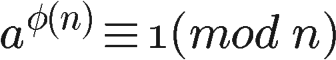
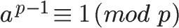

### Cipher 密码  
主要分为对称加密和非对称加密; 
 
密钥, 是改变密码行为的数字化参数; 
对称密钥加密, 编 / 解码使用相同密钥的算法;  
非对称密钥加密, 编 / 解码使用不同密钥的算法;  
公开密钥加密系统, 一种能够使数百万计算机, 便捷地发送机密报文的系统;  
数字签名, 用来验证报文未被伪造或篡改的校验和;  
数字证书, 由一个可信的组织验证和签发的识别信息;  

### SymmetricCipher 对称加密  
对称加密, 又称对称密钥加密, 私钥加密;  

对称加密的, 信息发送方和接收方, 使用同一个密钥去加密和解密数据;  
对称加密的特点是, 算法公开, 加密和解密速度快, 适合于对大数据量进行加密;  
其加密过程如下: 明文 + 加密算法 + 私钥 => 密文;  
解密过程如下: 密文 + 解密算法 + 私钥 => 明文;  

对称加密中用到的密钥叫做私钥, 私钥表示个人私有的密钥, 即该密钥不能被泄露;  
否则密文就很容易被破解, 所以对称加密的缺点是, 密钥安全管理困难;  

对称密钥常用算法
AES, DES, Triple-DES(3DES), RC2, RC4, RC5, TDEA, Blowfish, IDEA, SKIPJACK 等;  
DES 加密原理, 主要是对比特位进行操作, 交换位置, 异或等等;  

对称加密应用场景  
本地数据加密, 例如加密android 里 SharedPreferences 里面的某些敏感数据;  
网络传输, 登录接口 post 请求参数加密 {username=lisi,pwd=oJYa4i9VASRoxVLh75wPCg==};  
加密用户登录结果信息, 并序列化到本地磁盘, 将 user 对象序列化到本地磁盘, 下次登录时反序列化到内存里;  

### 散列函数  
散列函数, 是将任意长度的输入转化为, 定长输出的算法, 散列函数的结果经常被简称为散列;  
编程中普遍使用散列函数, 但并非所有散列函数都适用于密码学, 密码学散列函数有以下几个额外特性:  
1.. 抗原像性(单向性)  
给定一个散列, 计算上无法找到或者构造出生成它的数据源;  
2.. 抗第二原像性(弱抗碰撞性)  
给定一条消息和它的散列, 计算上无法找到不同的消息具有相同的散列;  
3.. 强抗碰撞性  
计算上无法找到两条散列相同的消息  

散列函数最常用的使用场合是, 以紧凑的方式表示, 并比较大量数据;  
比如, 为了避免直接比较两个文件 (可能很难, 比方说, 它们存放于世界上不同的位置),  你可以比较它们的散列;  
散列函数经常被称为指纹, 消息摘要, 或者简单称为摘要;    
现在使用最为广泛的散列函数是 SHA1, 它的输出是160位, 由于 SHA1 已经变弱, 所以建议升级为 SHA256;  
与密码不同, 散列函数的强度并不与散列长度对等;  

### 非对称加密   
非对称加密, 又称公钥加密;  
非对称加密与对称加密相比, 其安全性更好;  而非对称加密使用一对密钥, 即公钥和私钥, 且二者成对出现;  
私钥被自己保存, 不能对外泄露;  公钥指的是公共的密钥, 任何人都可以获得该密钥;  
用公钥或私钥中的任何一个进行加密, 用另一个进行解密;  
被公钥加密过的密文只能被私钥解密, 过程如下: 
明文 + 加密算法 + 公钥 => 密文,  密文 + 解密算法 + 私钥 => 明文;  
被私钥加密过的密文只能被公钥解密, 过程如下: 
明文 + 加密算法 + 私钥 => 密文,  密文 + 解密算法 + 公钥 => 明文;  
非对称加密的缺点是加密和解密花费时间长, 速度慢, 只适合对少量数据进行加密;  

在非对称加密中使用的主要算法有：RSA, Elgamal, Rabin, D-H, ECC(椭圆曲线加密算法)等;  

RSA 的原理, 两个大质数(p,q)乘积(n)难以逆向求解, 所以 pq 是对等的, 公钥和私钥也是对等的;  

❀ 使用方称为甲方, 提供方称为乙方;  
乙方通过相关技术, 生成两种密钥, 公钥和私钥, 乙方保管私钥, 向外公布公钥(任何人都可以使用);  
甲方得到乙方提供的公钥, 对明文进行加密操作;  
乙方得到加密的密文, 用私钥进行解密操作;  

❀ 互质关系  
如果两个正整数, 除了1以外, 没有其他公因子, 我们就称这两个数是互质关系;  
比如, 15和32没有公因子, 所以它们是互质关系, 这说明, 不是质数也可以构成互质关系;  

关于互质关系, 不难得到以下结论:  
两个不同的质数一定是互质数, 例如, 2与7, 13与19;  
相邻的两个自然数是互质数, 如 15与 16;  
相邻的两个奇数是互质数, 如 49与 51;  
较大数是质数的两个数是互质数, 如97与88;  
小数是质数, 大数不是小数的倍数的两个数是互质数; 例如 7和 16;  
2和任何奇数是互质数, 例如2和87;  
1和任意一个自然数是都是互质关系, 比如1和99;   
p 是大于1的奇数, 则 p 和 p-2 构成互质关系, 比如17和15;  

❀ 同余  
两个整数 a, b,  a mod n = b mod n, 则称 a, b 对于模 n 同余, 记作: a ≡ b (mod n);  
❀ 费马小定理  
如果p是质数, 且gcd(a, p) = 1, 那么 a ^ (p-1) mod p = 1 mod p, 记作  a ≡ 1 (mod p); 

[欧拉函数](euler_function.md)  
❀ 欧拉定理  
定理:   
(1)若n是素数p的k次幂, φ(n)=p^k-p^(k-1)=(p-1)p^(k-1), 因为除了p的倍数外, 其他数都跟n互质 ;    
(2)欧拉函数是积性函数——若m, n互质, φ(m*n)=φ(m)φ(n);    
特殊性质:   
1)当n为奇数时, φ(2n)=φ(n);    
2)p是素数, φ(p) = p - 1, φ(p)称为p的欧拉值;  

如果两个正整数a和n互质, 则n的欧拉函数 φ(n) 可以让下面的等式成立:   
    
也就是说, a的φ(n)次方被n除的余数为1;或者说, a的φ(n)次方减去1, 可以被n整除;  

欧拉定理有一个特殊情况:  
假设正整数a与质数p互质, 因为质数p的φ(p)等于p-1, 则欧拉定理可以写成  
     

❀ 比较一下  
对称加密:   
同一个密钥, 速度快, 效率高;  
在传输过程中, 密钥会联同报文一起;   

非对称加密:   
公钥, 私钥, 密钥对形式, 加密速度慢, 解密速度更慢;  
主要用在数字签名, 对密钥签名上;  

### 词条  
gcd                 greatest common divisor                 最大公约数  
对称加密     symmetric encryption;    
私钥加密     private-key cryptography;  
公钥加密     public key cryptography;  
散列函数     hash function;  

### 参考  
https://www.kancloud.cn/kancloud/rsa_algorithm/48493  
http://blog.csdn.net/jiange_zh/article/details/49339289  
http://blog.csdn.net/q376420785/article/details/8557266  
https://www.jianshu.com/p/53b9ffe8fea6  

欧拉函数  
http://blog.csdn.net/wangjian8006/article/details/7833319  

  
